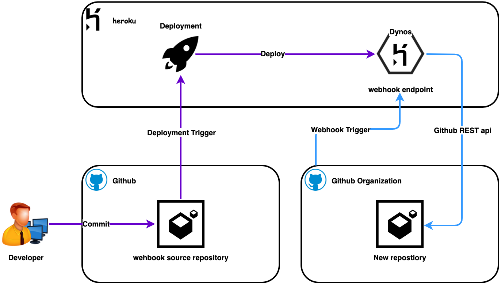

# Github Home Test

A simple web application listen to events from Github on creation of new repositories.

## Design:



An event of new repository creation in github organization triggers a webhook that sends POST REST call with json payload to webhook endpoint service hosted on Heroku app environment. Go web application running in heroku enviornment receives POST api call with json payload body which process the payload and invoke REST calls to github to create branch protection rule and an issue within newly created repository.

- ### Deployment design
It uses [heroku Dynos](https://www.heroku.com/dynos) platform to host web applicaton. heroku provides [Github integration](https://devcenter.heroku.com/articles/github-integration) to trigger automatic deployment on commits. Once developer pushes the code updates will initiate the deployment in heroku which runs build on updated code and releases to Dynos platform.

- ### Application design
It is a small web application which receives the subscribed organization events (i.e repository changes) from github through [webhook](https://docs.github.com/en/developers/webhooks-and-events/webhooks/about-webhooks) integration. Web application is written in Golang accepts [Repository events](https://docs.github.com/en/developers/webhooks-and-events/webhooks/webhook-events-and-payloads#repository) and filter `"action": "created"` event which indicates a new repo is created in the organization. It proceed with below twon actions,
1. [Create branch protection](https://docs.github.com/en/rest/reference/repos#update-branch-protection) for `main` branch
2. [Create an issue](https://docs.github.com/en/rest/reference/issues#create-an-issue) within new repository outlines that branch protection is enabled and tagged to a person to notify.

## Pre-requisites:
- [Heroku account](https://signup.heroku.com/)
- [Github organization](https://docs.github.com/en/organizations/collaborating-with-groups-in-organizations/creating-a-new-organization-from-scratch)
- [Github personal access token](https://docs.github.com/en/github/authenticating-to-github/keeping-your-account-and-data-secure/creating-a-personal-access-token) - select scopes `repo:status` and `public_repo`
- [Heroku CLI](https://devcenter.heroku.com/articles/heroku-cli#download-and-install)
- [Git CLI](https://git-scm.com/downloads)
    
## Deployment:
1. Create Heroku account
2. Install Heroku cli on Mac
> Note: Heroku requires Git. If you don’t already have Git installed, please [install Git](https://git-scm.com/downloads) before Heroku CLI   
> Go [Here](https://devcenter.heroku.com/articles/heroku-cli#download-and-install) for installing on Windows  
```
$ brew tap Heroku/brew && brew install Heroku
```
3. Login to Heroku using cli 
```
$ heroku login -i
```
4. Create heroku application
```
$ heroku create 
```
>This will generate a random APPNAME, please take down the appname for future steps.
5. Setup enviornment variables
```
$ export TOKEN="XXXXXXX"
$ heroku config:set TOKEN=$TOKEN --app [APPNAME]
```
6. Setup github integration with heroku application
  - Login to [heroku dashboard](https://dashboard.heroku.com)
  - [Configure Github integration](https://devcenter.heroku.com/articles/github-integration) for newly created heroku application
    - >Note: If this needs to work for repository inside an organization, you need to enable thrid party access inside organization settings
  - Run manual deploy for first time and setup automatically deployment for `main` branch
7. Test home page accessible
```
$ curl https://[APPNAME].herokuapp.com
```
8. Configure webhook in github
  - Goto: Org Settings -> Webhooks -> Add Webhook -> Enter
    - Payload URL: https://[APPNAME].herokuapp.com/webhook
    - Content type: application/json
    - Triggers: Repositories

9. Test by creating new public repository in the organization
  - Create a new repository
  - Select **Public** repository
  - Select **Add a README file**
  - Check the issues are created and branch protection is set in the repository

## Local build and test:
1. Checkout repository locally
```
$ git clone git@github.com:nidhish-org/hometest.git
$ cd hometest
```
2. Setup enviornment variables
```
$ export PORT=8080
$ export TOKEN="XXXXXXX"
```
3. Run unit test
```
$ go test -cover -v ./...
```
4. Build and run application locally
```
$ go build -o hometest main.go
$ chmod 755 hometest
$ ./hometest
```
5. Test application running
```
$ curl http://localhost:8080
```

## 📖 References:
1. https://devcenter.heroku.com